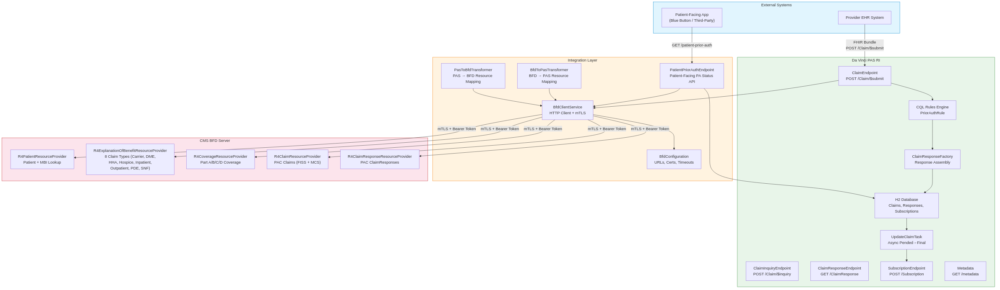
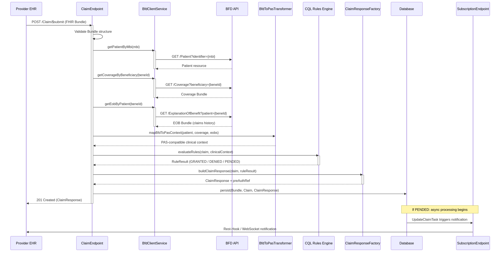
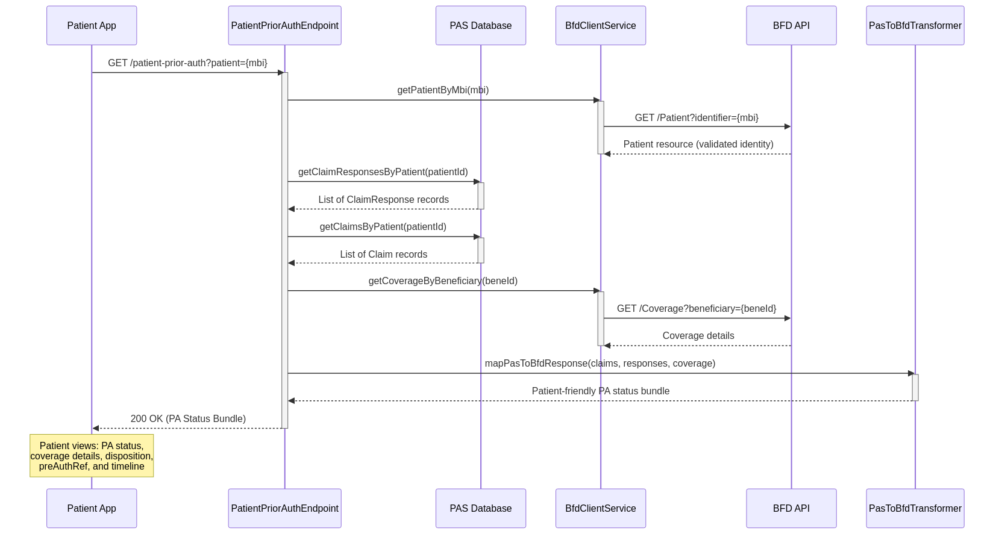
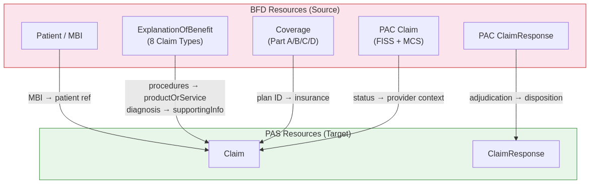
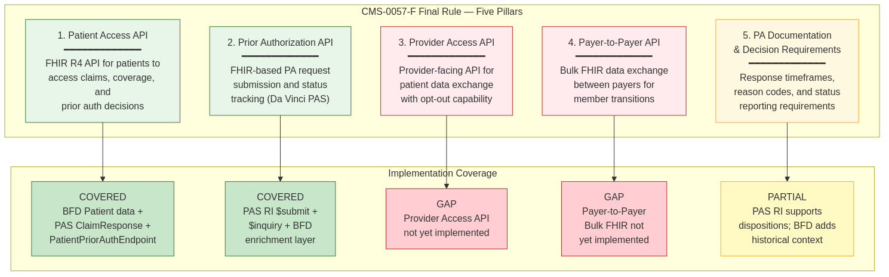
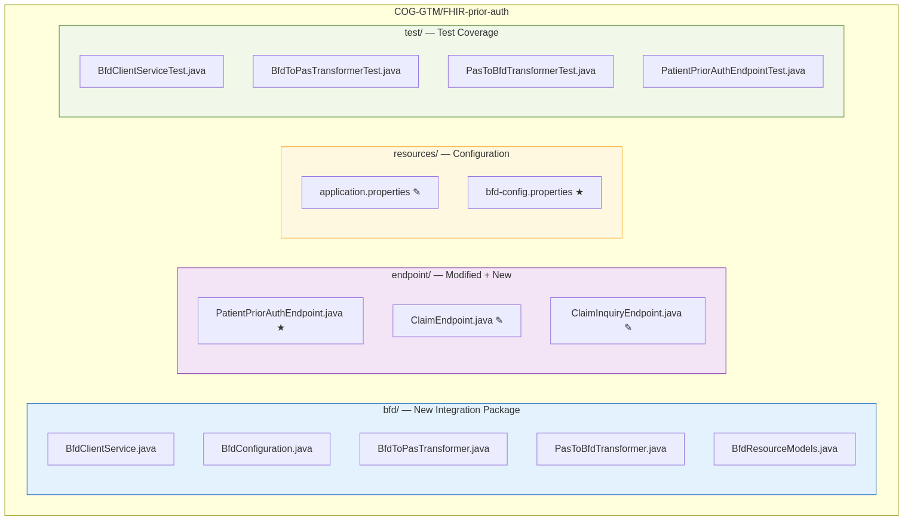

# CMS-0057-F Compliance: BFD-to-PAS Integration Architecture

**Version 1.0 | April 2026**

---

## Executive Summary

This document presents the integration architecture for connecting CMS's Beneficiary FHIR Data (BFD) Server with the Da Vinci Prior Authorization Support (PAS) Reference Implementation to meet CMS-0057-F compliance requirements. The integration enables prior authorization decisions enriched with real Medicare claims history, and exposes PA status to patients and providers via standardized FHIR APIs.

---

## 1. Architecture Overview

The architecture connects external consumers (Provider EHRs, Patient Apps) through a new integration layer to both the PAS RI and CMS BFD Server. The integration layer handles mTLS authentication, bidirectional data transformation between CARIN Blue Button and Da Vinci profiles, and a patient-facing PA status endpoint.

---

## 2. Claim Submission Flow (BFD-Enriched)

When a provider submits a prior authorization request, the system validates the patient's MBI against BFD, retrieves coverage and claims history, transforms the data into PAS-compatible structures, and evaluates CQL clinical rules before generating a ClaimResponse with disposition (Granted / Denied / Pended).

---

## 3. Patient Access to PA Status

Patient-facing applications retrieve prior authorization status through the PatientPriorAuthEndpoint, which combines PAS database records with BFD beneficiary data — satisfying the CMS-0057-F Patient Access API requirement.

---

## 4. Field-Level Data Mapping (BFD to PAS)

BFD resources (Patient/MBI, ExplanationOfBenefit across 8 claim types, Coverage, PAC Claims FISS/MCS, PAC ClaimResponses) are mapped to PAS Claim and ClaimResponse fields through dedicated transformer classes. Key mappings include MBI to patient reference, EOB procedure codes to item.productOrService, Coverage to insurance, and PAC adjudication to ClaimResponse disposition.

---

## 5. CMS-0057-F Compliance Coverage

| Pillar | Status | Notes |
|--------|--------|-------|
| **Patient Access API** | **Covered** | PatientPriorAuthEndpoint + BFD Patient/Coverage/EOB |
| **Prior Authorization API** | **Covered** | PAS RI $submit/$inquiry + BFD enrichment |
| **Provider Access API** | **Gap** | Requires new endpoint + consent management |
| **Payer-to-Payer API** | **Gap** | Requires Bulk FHIR + inter-payer trust framework |
| **PA Documentation** | **Partial** | PAS dispositions supported; SLA enforcement + X12 278 reason codes needed |

---

## 6. Module Layout

The integration adds 13 new files (5 in `bfd/`, 1 new endpoint, 1 config file, 4 tests, 2 doc/script files) and modifies 7 existing files (ClaimEndpoint, ClaimInquiryEndpoint, App, Database, FhirUtils, application.properties, build.gradle).

---

*Prepared for CMS-0057-F compliance readiness review.*
