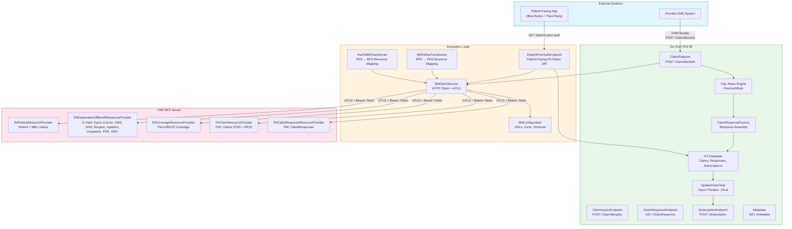
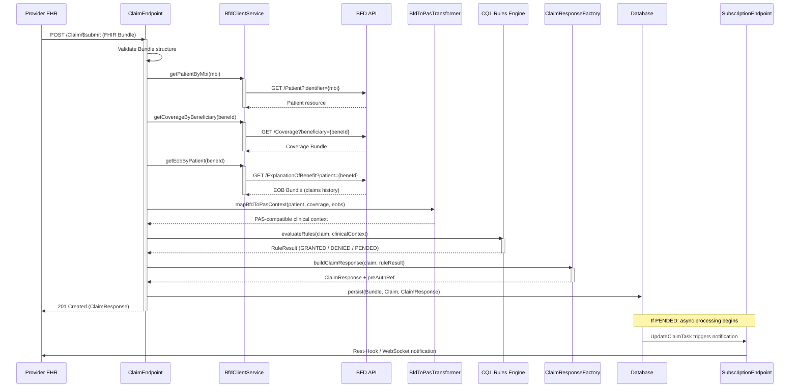
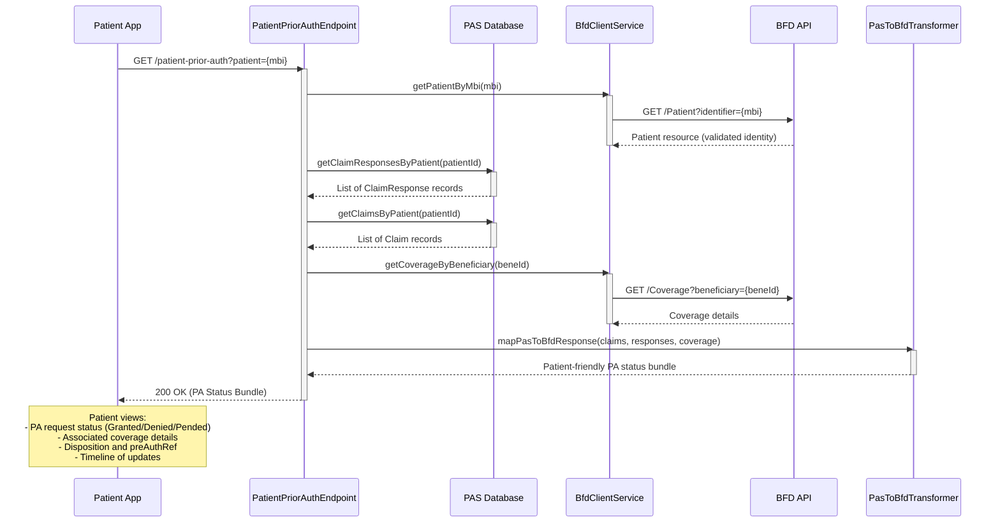
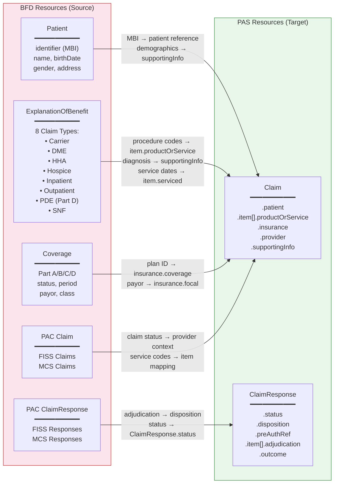
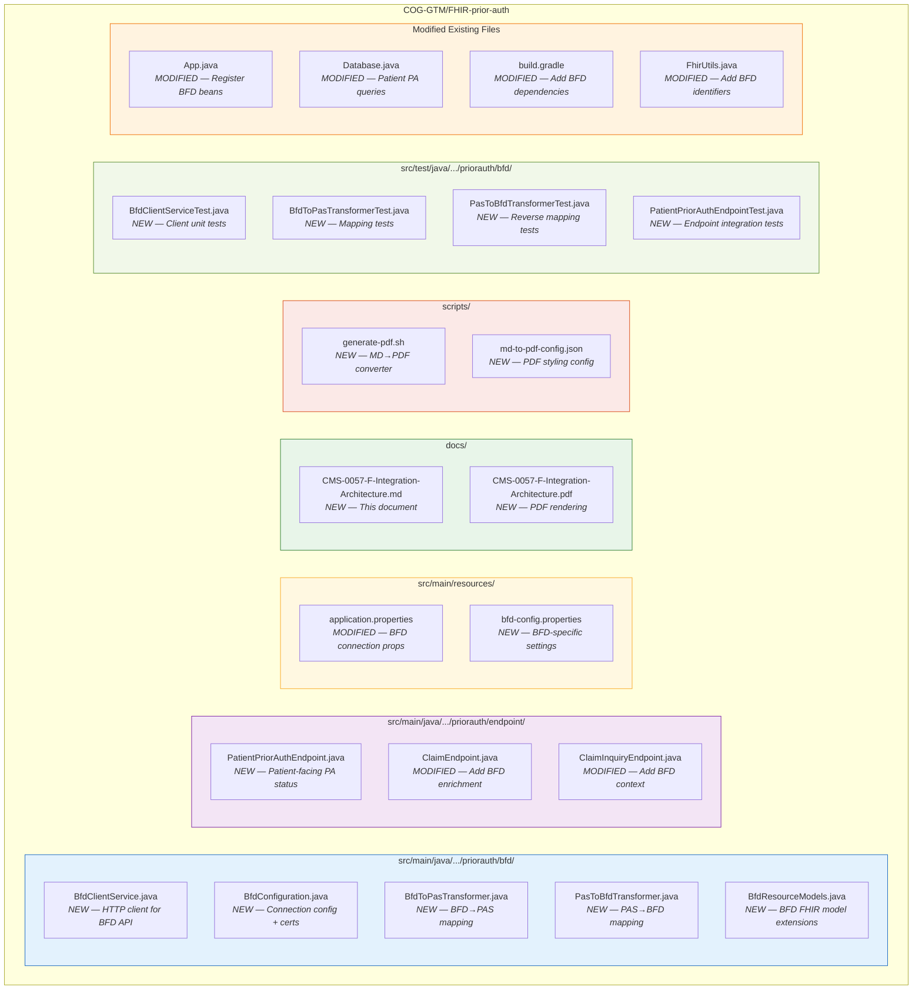
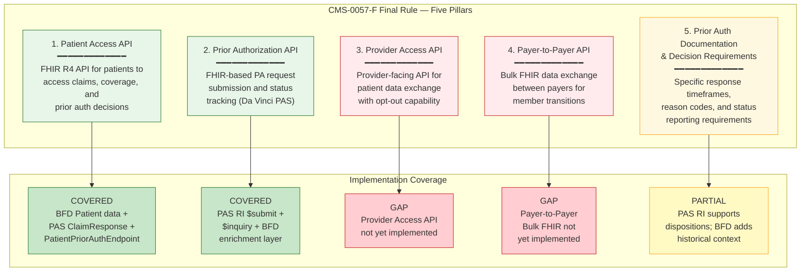

# CMS-0057-F Compliance: BFD-to-PAS Integration Architecture

**Document Version:** 1.0
**Date:** April 3, 2026
**Classification:** Internal — Compliance Planning
**Repository:** COG-GTM/FHIR-prior-auth

---

## Table of Contents

1. [Executive Summary](#executive-summary)
2. [Architecture Overview](#architecture-overview)
3. [Data Flow: Claim Submission with BFD Validation](#data-flow-claim-submission-with-bfd-validation)
4. [Data Flow: Patient Access to PA Status](#data-flow-patient-access-to-pa-status)
5. [Field-Level Data Mapping](#field-level-data-mapping)
6. [Module Layout](#module-layout)
7. [CMS-0057-F Compliance Coverage Matrix](#cms-0057-f-compliance-coverage-matrix)
8. [Gap Analysis Summary](#gap-analysis-summary)
9. [File Inventory](#file-inventory)
10. [Appendix: Terminology](#appendix-terminology)

---

## Executive Summary

The CMS Interoperability and Prior Authorization Final Rule (CMS-0057-F) mandates that Medicare Advantage organizations, Medicaid and CHIP managed care plans, and QHP issuers on the Federally-facilitated Exchanges implement standardized FHIR-based APIs for prior authorization, patient access, provider directory, and payer-to-payer data exchange.

This document presents the integration architecture for connecting two critical CMS open-source systems:

- **Beneficiary FHIR Data (BFD) Server** — The CMS production system that ingests, stores, and serves Medicare beneficiary claims data (Patient, ExplanationOfBenefit, Coverage, Claim, ClaimResponse) via a FHIR R4 API. BFD is the authoritative source of Medicare beneficiary and claims information.

- **Da Vinci Prior Authorization Support (PAS) Reference Implementation** — An HL7-conformant FHIR server that processes prior authorization requests using CQL-based clinical rules, manages the ClaimResponse lifecycle (Granted / Denied / Pended), and supports asynchronous notifications via Subscriptions.

**Integration Goal:** Establish a bidirectional data bridge between BFD and PAS so that (1) prior authorization decisions are enriched with real Medicare claims history, and (2) patients and providers can access prior authorization status alongside their benefits data — satisfying CMS-0057-F requirements for Patient Access API, Prior Authorization API, and Provider Access API.

---

## Architecture Overview

The following diagram illustrates the full system architecture, showing external consumers, the integration layer, and the two core systems.

**Key Design Decisions:**

- **mTLS Authentication:** All BFD API calls use mutual TLS with client certificates, matching BFD's production security model.
- **Transformer Pattern:** Dedicated transformer classes (BfdToPasTransformer, PasToBfdTransformer) handle the structural and semantic mapping between BFD's CARIN Blue Button profiles and PAS's Da Vinci profiles.
- **Patient-Facing Endpoint:** A new PatientPriorAuthEndpoint provides CMS-0057-F-compliant patient access to prior authorization status, combining PAS database records with BFD beneficiary data.

---

## Data Flow: Claim Submission with BFD Validation

This sequence diagram shows the complete flow when a provider submits a prior authorization request, including BFD enrichment for claims history validation.

**Processing Steps:**

1. **Bundle Validation** — The ClaimEndpoint validates the incoming FHIR Bundle structure per the PAS IG.
2. **BFD Patient Lookup** — The system resolves the patient's Medicare Beneficiary Identifier (MBI) against BFD to confirm eligibility.
3. **Coverage Verification** — Active Part A/B/C/D coverage is retrieved from BFD to validate insurance information.
4. **Claims History Retrieval** — Historical ExplanationOfBenefit records (across all 8 claim types) are fetched to provide clinical context for the rules engine.
5. **Data Transformation** — BFD resources (CARIN Blue Button profiles) are mapped to PAS-compatible structures (Da Vinci profiles) via the BfdToPasTransformer.
6. **CQL Rule Evaluation** — Clinical rules evaluate the prior authorization request against the enriched clinical context.
7. **Response Assembly** — The ClaimResponseFactory builds the response with disposition (Granted/Denied/Pended) and preAuthRef.
8. **Persistence & Notification** — All resources are persisted; pended claims trigger asynchronous processing and subscription notifications.

---

## Data Flow: Patient Access to PA Status

This sequence diagram shows how a patient-facing application retrieves prior authorization status, combining PAS records with BFD beneficiary data.

**Key Behaviors:**

- **Identity Verification:** The patient's MBI is validated against BFD before any PAS data is returned, ensuring proper authorization.
- **Comprehensive Response:** The response bundle combines prior authorization status from PAS with coverage and eligibility details from BFD.
- **CMS-0057-F Compliance:** This endpoint satisfies the Patient Access API requirement by exposing prior authorization decisions alongside benefits information.

---

## Field-Level Data Mapping

The following diagram and table show the detailed field-level mapping between BFD resources and PAS resources.

### Detailed Field Mapping Table

| # | BFD Resource | BFD Field | PAS Resource | PAS Field | Transform Logic |
|---|-------------|-----------|-------------|-----------|-----------------|
| 1 | Patient | `identifier[MBI]` | Claim | `patient.reference` | Direct reference by MBI lookup |
| 2 | Patient | `name`, `birthDate`, `gender` | Claim | `supportingInfo` | Map to PAS SupportingInfo slice for demographics |
| 3 | ExplanationOfBenefit | `item[].productOrService` | Claim | `item[].productOrService` | Map CPT/HCPCS codes from historical claims |
| 4 | ExplanationOfBenefit | `diagnosis[]` | Claim | `supportingInfo` | ICD-10 codes mapped to clinical context |
| 5 | ExplanationOfBenefit | `item[].serviced[x]` | Claim | `item[].serviced[x]` | Date/Period passthrough for service timeline |
| 6 | ExplanationOfBenefit | `type.coding` | Claim | `type` | Map BFD claim type to PAS claim type |
| 7 | ExplanationOfBenefit | `provider` | Claim | `provider` | NPI-based provider reference |
| 8 | Coverage | `status`, `period` | Claim | `insurance[].coverage` | Active coverage validation and reference |
| 9 | Coverage | `payor` | Claim | `insurance[].focal` | Primary/secondary insurance determination |
| 10 | Coverage | `class[]` (Plan/Group) | Claim | `insurance[].preAuthRef` | Plan identifier for PA routing |
| 11 | PAC Claim (FISS) | `status`, `type` | Claim | `provider` context | Institutional claim context enrichment |
| 12 | PAC Claim (MCS) | `status`, `type` | Claim | `provider` context | Professional claim context enrichment |
| 13 | PAC ClaimResponse | `disposition` | ClaimResponse | `disposition` | Map BFD adjudication to PAS disposition |
| 14 | PAC ClaimResponse | `outcome` | ClaimResponse | `outcome` | Direct status mapping (complete/partial/error) |
| 15 | PAC ClaimResponse | `item[].adjudication` | ClaimResponse | `item[].adjudication` | Financial adjudication detail passthrough |

---

## Module Layout

The following diagram shows the organization of all new and modified files in the COG-GTM/FHIR-prior-auth repository, organized by package.

---

## CMS-0057-F Compliance Coverage Matrix

The following diagram and table map the five CMS-0057-F regulatory pillars to their implementation status within this integration architecture.

### Compliance Coverage Table

| Pillar | CMS-0057-F Requirement | Status | Implementation Details | Gaps |
|--------|----------------------|--------|----------------------|------|
| **1. Patient Access API** | Patients must access claims, clinical data, and PA decisions via FHIR R4 | **COVERED** | PatientPriorAuthEndpoint combines PAS ClaimResponse data with BFD Patient/Coverage/EOB | None for core requirement |
| **2. Prior Authorization API** | Payers must support FHIR-based PA submission and status (Da Vinci PAS IG) | **COVERED** | PAS RI implements $submit and $inquiry; BFD integration enriches with claims history | Production hardening needed |
| **3. Provider Access API** | Providers must access patient data with opt-out capability | **GAP** | Not implemented in current architecture | Requires new endpoint, consent management, and provider directory integration |
| **4. Payer-to-Payer API** | Bulk FHIR exchange between payers during member transitions | **GAP** | Not implemented in current architecture | Requires FHIR Bulk Data Access IG implementation, inter-payer trust framework |
| **5. PA Documentation** | Specific timeframes (72h urgent / 7d standard), reason codes, status tracking | **PARTIAL** | PAS RI supports Granted/Denied/Pended dispositions; BFD adds historical context | Need configurable SLA enforcement, X12 278 reason code mapping, denial reason reporting |

---

## Gap Analysis Summary

The following table summarizes the seven key gaps identified in the current architecture that must be addressed for full CMS-0057-F compliance.

| # | Gap | Severity | Description | Remediation Path | Effort Estimate |
|---|-----|----------|-------------|-----------------|-----------------|
| 1 | **No BFD Integration Exists** | Critical | PAS RI operates in isolation with no connection to Medicare claims data. All prior authorization decisions are made without beneficiary history. | Implement BfdClientService, BfdConfiguration, and transformer classes as described in this architecture. | 4-6 weeks |
| 2 | **PA Status Not Exposed to Patients** | Critical | No patient-facing API exists to retrieve prior authorization status. CMS-0057-F requires this for the Patient Access API pillar. | Implement PatientPriorAuthEndpoint with BFD identity verification and PAS data aggregation. | 2-3 weeks |
| 3 | **Provider Access API Missing** | High | CMS-0057-F requires a provider-facing API for accessing patient data with opt-out capability. Neither BFD nor PAS currently offers this. | Design and implement a Provider Access endpoint with consent management, leveraging BFD data and PAS PA records. | 6-8 weeks |
| 4 | **Payer-to-Payer API Missing** | High | Bulk FHIR data exchange between payers for member transitions is not implemented. Required for the Payer-to-Payer API pillar. | Implement FHIR Bulk Data Access IG ($export), establish inter-payer trust framework, build data reconciliation logic. | 8-12 weeks |
| 5 | **PAS RI Not Production-Ready** | Medium | The PAS RI uses an in-memory H2 database, has hardcoded admin tokens, and lacks production security controls. | Replace H2 with PostgreSQL, implement proper OAuth 2.0, add audit logging, implement rate limiting and input validation per STIG standards. | 4-6 weeks |
| 6 | **Security Model Mismatch** | Medium | BFD uses mTLS with client certificates; PAS RI uses a simplified bearer token model. The integration must bridge both authentication models. | Implement mTLS client in BfdClientService, add certificate management to BfdConfiguration, establish trust chain between systems. | 2-3 weeks |
| 7 | **Subscription Infrastructure** | Low | PAS RI subscription support (Rest-Hook, WebSocket) is functional but not tested at scale. CMS-0057-F requires reliable async notifications. | Load test subscription infrastructure, implement retry logic, add dead-letter queue for failed notifications, integrate with BFD event streams. | 3-4 weeks |

**Total Estimated Effort:** 29-42 weeks (for full CMS-0057-F compliance across all pillars)

**Recommended Phasing:**

- **Phase 1 (Weeks 1-6):** BFD Integration + Patient Access API (Gaps 1, 2, 6)
- **Phase 2 (Weeks 7-12):** Production Hardening + PA Documentation (Gaps 5, 7)
- **Phase 3 (Weeks 13-20):** Provider Access API (Gap 3)
- **Phase 4 (Weeks 21-32):** Payer-to-Payer API (Gap 4)

---

## File Inventory

### New Files (13)

| # | File Path | Description |
|---|-----------|-------------|
| 1 | `src/main/java/.../priorauth/bfd/BfdClientService.java` | HTTP client for BFD FHIR API with mTLS authentication, retry logic, and circuit breaker |
| 2 | `src/main/java/.../priorauth/bfd/BfdConfiguration.java` | Configuration management for BFD connection parameters, certificate paths, and timeouts |
| 3 | `src/main/java/.../priorauth/bfd/BfdToPasTransformer.java` | Maps BFD CARIN Blue Button resources to Da Vinci PAS-compatible structures |
| 4 | `src/main/java/.../priorauth/bfd/PasToBfdTransformer.java` | Maps PAS ClaimResponse and Claim data back to BFD-compatible format for patient access |
| 5 | `src/main/java/.../priorauth/bfd/BfdResourceModels.java` | Extended FHIR model classes for BFD-specific resource profiles |
| 6 | `src/main/java/.../priorauth/endpoint/PatientPriorAuthEndpoint.java` | Patient-facing REST endpoint for prior authorization status retrieval |
| 7 | `src/main/resources/bfd-config.properties` | BFD-specific configuration properties (URLs, certificate paths, feature flags) |
| 8 | `src/test/java/.../priorauth/bfd/BfdClientServiceTest.java` | Unit tests for BFD client service including mock server responses |
| 9 | `src/test/java/.../priorauth/bfd/BfdToPasTransformerTest.java` | Unit tests for BFD-to-PAS data transformation accuracy |
| 10 | `src/test/java/.../priorauth/bfd/PasToBfdTransformerTest.java` | Unit tests for PAS-to-BFD reverse transformation |
| 11 | `src/test/java/.../priorauth/bfd/PatientPriorAuthEndpointTest.java` | Integration tests for the patient-facing prior auth endpoint |
| 12 | `docs/CMS-0057-F-Integration-Architecture.md` | This architecture document |
| 13 | `docs/CMS-0057-F-Integration-Architecture.pdf` | PDF rendering of this architecture document |

### Modified Files (7)

| # | File Path | Modification Description |
|---|-----------|-------------------------|
| 1 | `src/main/java/.../priorauth/App.java` | Register BFD service beans, add BFD context initialization |
| 2 | `src/main/java/.../priorauth/Database.java` | Add patient-specific prior authorization queries for the PatientPriorAuthEndpoint |
| 3 | `src/main/java/.../priorauth/endpoint/ClaimEndpoint.java` | Integrate BfdClientService calls during $submit processing for claims history enrichment |
| 4 | `src/main/java/.../priorauth/endpoint/ClaimInquiryEndpoint.java` | Add BFD context to $inquiry responses for richer status information |
| 5 | `src/main/java/.../priorauth/FhirUtils.java` | Add BFD identifier constants, MBI handling utilities, and profile URL mappings |
| 6 | `src/main/resources/application.properties` | Add BFD connection configuration properties and feature flags |
| 7 | `build.gradle` | Add BFD client dependencies (HAPI FHIR client, HTTP client with mTLS, test dependencies) |

### Supporting Files (2)

| # | File Path | Description |
|---|-----------|-------------|
| 1 | `scripts/generate-pdf.sh` | Shell script to convert the Markdown architecture document to PDF |
| 2 | `scripts/md-to-pdf-config.json` | Configuration file for md-to-pdf styling (margins, headers, CSS) |

---

## Appendix: Terminology

| Abbreviation | Full Term |
|-------------|-----------|
| **BFD** | Beneficiary FHIR Data (CMS Medicare claims API) |
| **PAS** | Prior Authorization Support (Da Vinci IG) |
| **RI** | Reference Implementation |
| **CQL** | Clinical Quality Language |
| **ELM** | Expression Logical Model (compiled CQL) |
| **MBI** | Medicare Beneficiary Identifier |
| **EOB** | Explanation of Benefit |
| **PAC** | Pre-Adjudication Claims |
| **FISS** | Fiscal Intermediary Shared System (institutional claims) |
| **MCS** | Multi-Carrier System (professional claims) |
| **mTLS** | Mutual Transport Layer Security |
| **CARIN** | Creating Access to Real-time Information Now (Blue Button framework) |
| **C4BB** | CARIN for Blue Button (FHIR profile) |
| **CMS-0057-F** | CMS Interoperability and Prior Authorization Final Rule |
| **FHIR** | Fast Healthcare Interoperability Resources (HL7 standard) |
| **Da Vinci** | HL7 Da Vinci Project (value-based care use cases) |
| **SLA** | Service Level Agreement |
| **PA** | Prior Authorization |

---

*Document prepared for CMS-0057-F compliance readiness review.*
*Generated from COG-GTM/FHIR-prior-auth repository analysis.*
